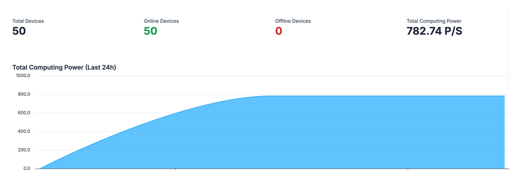
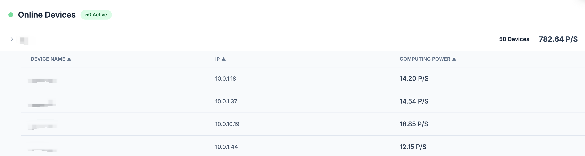

# Proxy

The parameters of the proxy are **almost identical** to the **prover**.  
On top of the proxy, we also have integrated a local ***monitoring service***.  

---

### Run Proxy  

**Note**: If you have more than 1,000 machines connecting to the same proxy, you need to adjust the Linux file descriptor limit first. You can do this by running `ulimit -n 20000` in the shell to raise the limit to 20,000, and then start the proxy software! Otherwise, you may encounter a `Too many open files (os error 24)` problem.

First, make sure the proxy has execution permissions:  

```bash
chmod +x ./golden-miner-pool-proxy
```  

**Minimal command:**  
```bash
./golden-miner-pool-proxy --pubkey=<your-pubkey>
```  
By default, the proxy runs on port `9999`.  

**Common command:**  
```bash
./golden-miner-pool-proxy --pubkey=<your-pubkey> --name=<proxy name> --port=<port>
```  

**Example:**  
```bash
./golden-miner-pool-proxy --port=9999 --name=proxy-A --pubkey=2ytTMttzXpc79BU9vtVNFkE3TWL15zedV8WZUHSpJwCLzUoHkh7GdZ74CFj2JbQg1gMfZxQCT5bRiDAk5ZHpDUDtD2GTxJQciTuNPuXc9hEm4cGv53kCEyxVETaiBW2HiPoX
```  

**Other parameters:**  
- `--label`: specify label, default value is `'proxy'`.  

---

### Run Prover  

⚠️ Note: Only **v0.1.3 or above** of the prover supports proxy.  

```bash
./golden-miner-pool-prover --proxy=<socket of your proxy> --label=<label> --name=<name>
```  

**Example:**  
If your proxy runs on `192.168.1.1` and the `--port` is set to `9999`,  
then a typical client command to connect to proxy would be:  

```bash
./golden-miner-pool-prover --proxy=192.168.1.1:9999 --label=cluster-A --name=A0
```  
In general, if your prover is pointed to a proxy, you shouldn’t set the `--pubkey` parameter on the prover. If you do set it, that pubkey must be the same as the one specified when the proxy starts.

---

### Monitoring  

Note: When the prover runs under proxy mode, detailed information of each prover will **not** be uploaded to the mining pool website.  
Instead, we integrate **local monitoring** on the proxy for you to check your machines.  

Once you start the proxy, you can access monitoring from `proxy port + 1`.  
For example, in the above case you may visit:  

```
http://192.168.1.1:10000
```  

This page shows the status of all provers connected through the proxy.  





In addition, we provide API endpoints:  

- `/api/metrics`:  

Access `http://192.168.1.1:10000/api/metrics` returns JSON:  
```json
[
    {"height":32179,"label":"cluster-A","local_ip":"10.0.1.1","name":"A0","rate":14.49,"timestamp":1758798241},
    ...
]
```  

Here, `timestamp` refers to the last time this machine reported to the proxy.  

- `/api/rates`:  

```json
[[1758798241, 300.49], ...]
```  

Each element has two values:  
1. timestamp  
2. the total hashrate of the proxy at that time  

---

⚠️ Please make sure `proxy port +1` and `proxy port +2` are not occupied.  
For example, if you run proxy with `--port=9999`, please make sure ports `9999, 10000, 10001` are all available.
If you’re using a public IP address, you should open the corresponding port in your firewall.
